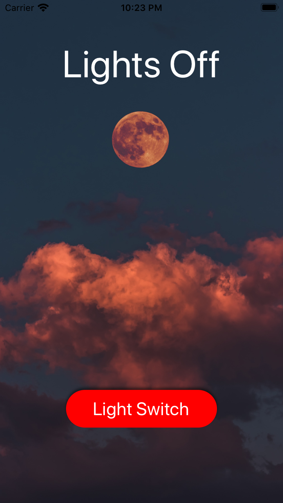

# Light Switch

A one button app that changes button text, title text, and the background picture when tapped.

## Created with

* Xcode 11
* Swift

## Key Takeaway's

* Conditional statements

* Custom buttons

## Screenshot

* Image assets provided by [Unsplash](https://unsplash.com/).

## Learning Resources

* [Sean Allen](https://seanallen.teachable.com/courses)
* [Paul Hudson](https://www.hackingwithswift.com)
* [Chris Ching](https://codewithchris.com/)

## Acknowledgments

* iOS Community

